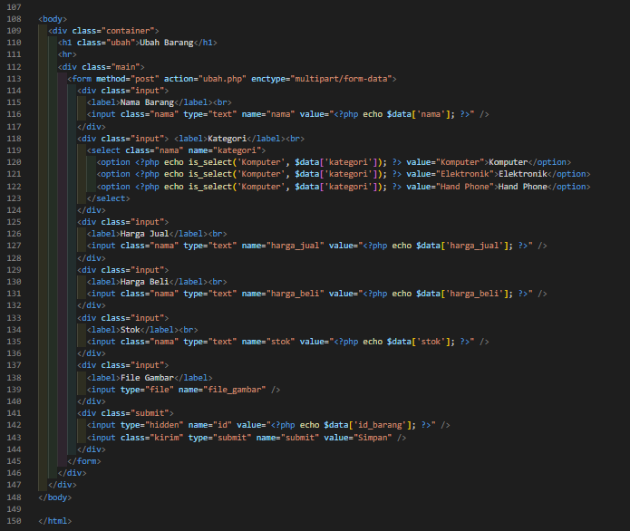
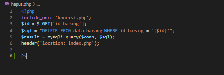
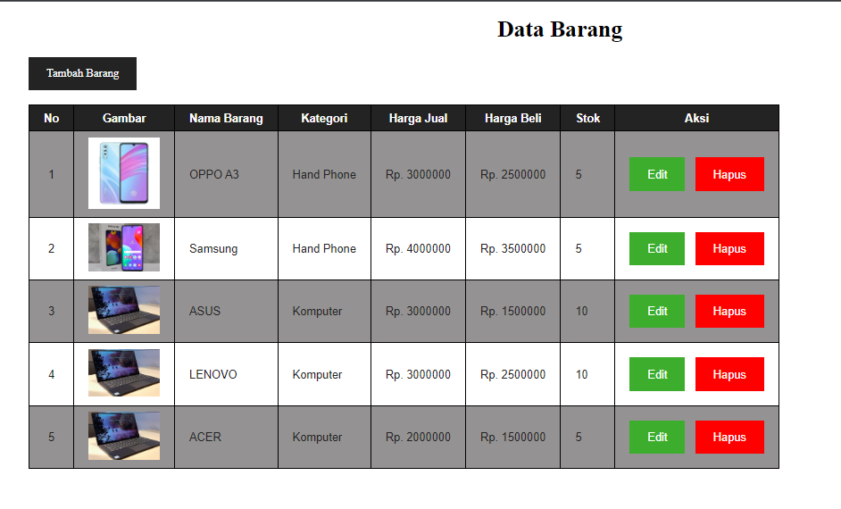
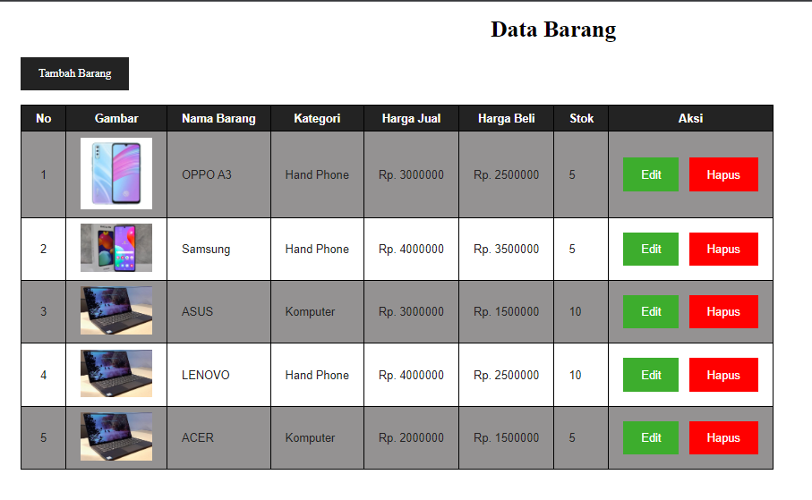

# Lab 8 WEB Database

## Membuat Koneksi Database

*  Untuk menghubungkan PHP dengan MYSQL, kita menggunakan fungsi `myssqli_connect()` dengan parameter alamat host/server, user, password, dan nama database. 

* jika koneksi gagal, variable `$conn akan bernilai ` false karna itu kita bisa mengeceknya dengan ekspresi `if`

## Membuat index.php

* Memanggil koneksi dengan `include("koneksi.php")`

## Membuat tambah.php

## Membuat ubah.php

## Membuat hapus.php

## Tampilan WEB

1. Bagian Tampilan awal

2. Bagian Tambah Barang

* Hasil Tambah Barang

3. Bagian Edit Barang

* Hasiil Ubah Barang

4. Bagian Hapus Barang

* Hasil dari hapus barang

